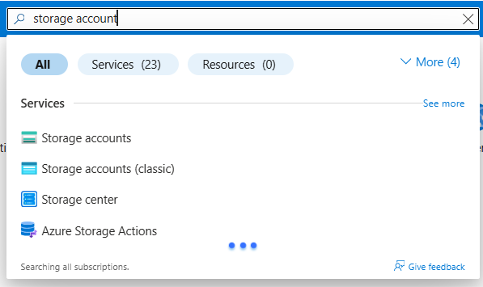

##📦 Lab 02: Azure Storage Account & Blob Upload

This lab demonstrates how to create an Azure Storage Account, create a blob container, and upload a file into it.

---

## 🔧 Configuration

| Setting              | Value              |
|----------------------|--------------------|
| Storage Account Name | lab2muqaddas       |
| Container Name       | myblob             |
| Access Level         | Private            |
| Region               | Asia pecific       |

---

## 📸 Screenshots

### 🔹 Step 1: Search Storage Accounts

### 🔹 Step 2: Create Storage Account

### 🔹 Step 3: Create Blob Container

### 🔹 Step 4: Upload a File

### 🔹 Step 5: Copy & Test Blob URL

---

## ✅ Result

Successfully created and configured a storage account in Microsoft Azure. Uploaded a file into a blob container and tested its access via blob URL.

---
