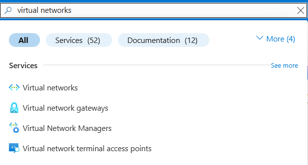
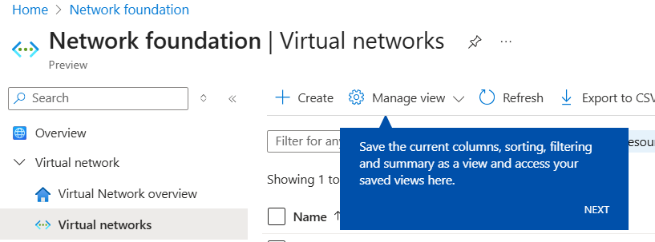
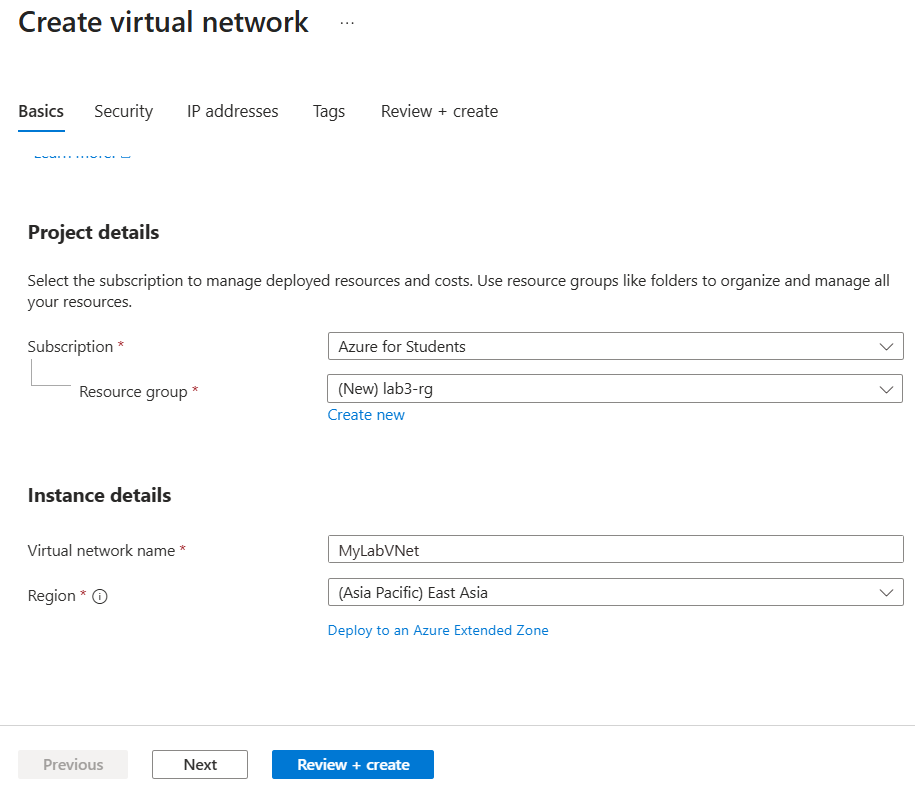
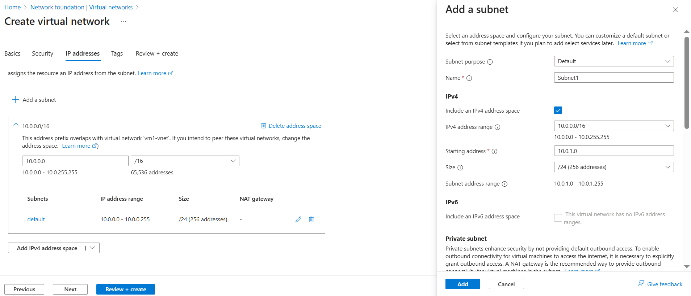
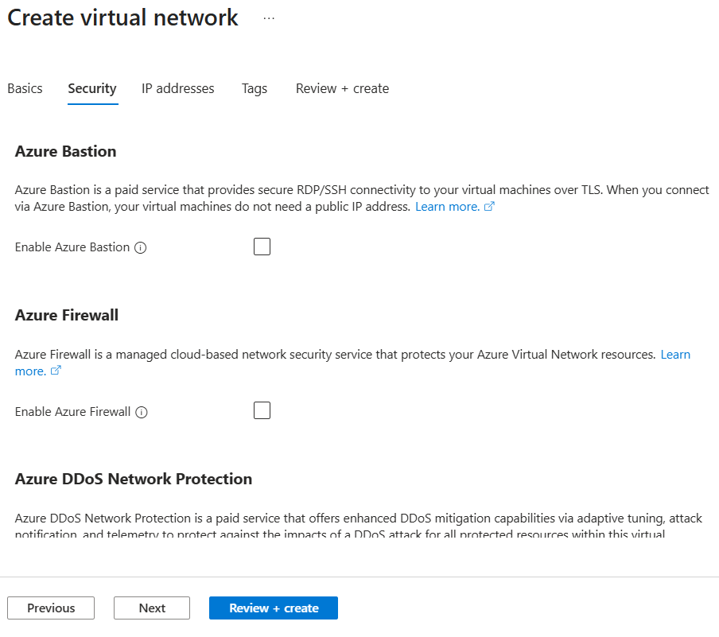
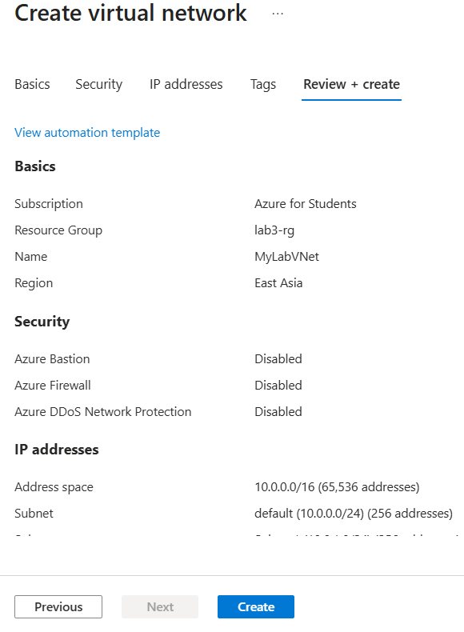
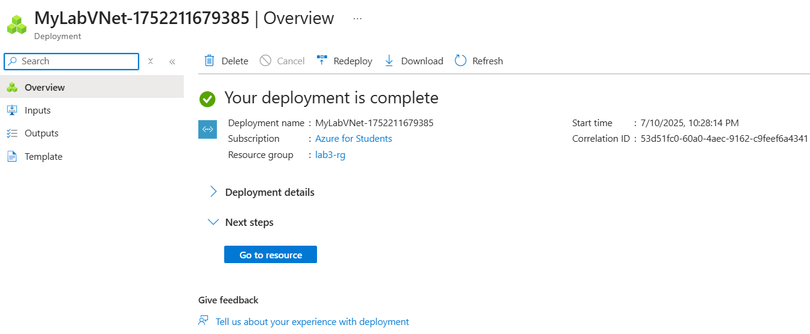
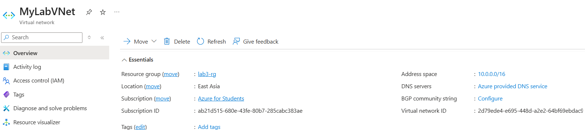
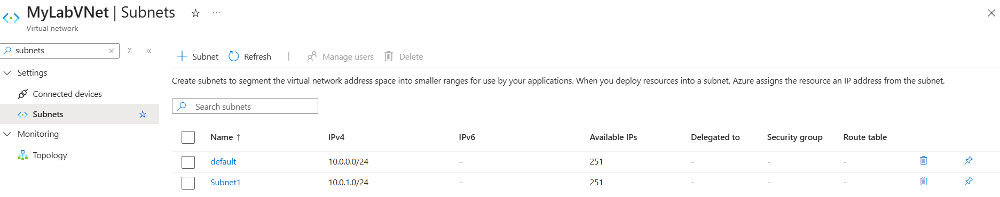
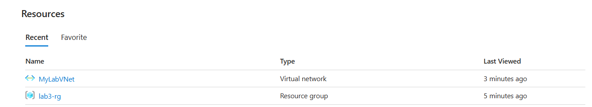

# 🌐 Lab 3: Create Azure Virtual Network (VNet)

## 📘 Introduction:

In this lab, I created a *Virtual Network (VNet)* in Microsoft Azure to learn how networking works in the cloud.  
A VNet is like a private network in the cloud that helps different resources (like VMs) communicate securely.

---

## 🧪 Steps Performed with Screenshots:

### ✅ Step 1: Search "Virtual Network" from Azure Portal

---

### ✅ Step 2: Click on "Create" Button to Start Deployment

---

### ✅ Step 3: Fill in the Basic Details of the VNet
- Name: MyLabVNet
- Subscription: Azure for Students
- Resource Group:lab3-rg
- Region: East Asia 

---

### ✅ Step 4: Configure IP Addresses & Subnet
- Address space: 10.0.0.0/16
- Subnet name: Subnet1
- Subnet range: 10.0.1.0/24

---

### ✅ Step 5: Leave Security Options Default
(DDoS, Firewall, Bastion – all left as default)

---

### ✅ Step 6: Review + Create
- After validation, click "Create"

---

### ✅ Step 7: Deployment Completed Successfully
- Azure shows deployment complete message

---

### ✅ Step 8: VNet Overview
- Overview of Virtual Network configuration

---

### ✅ Step 9: Check Subnet Under VNet
- Verify the Subnet1 is created

---

### ✅ Step 10: View in Resource Group
- Go to Resource Group and see VNet listed

---

## ✅ Lab Completed Successfully    
🔖 Task: Create Azure Virtual Network

