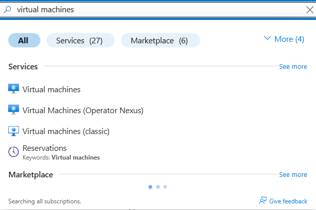
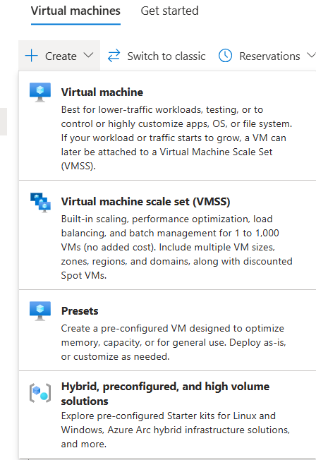
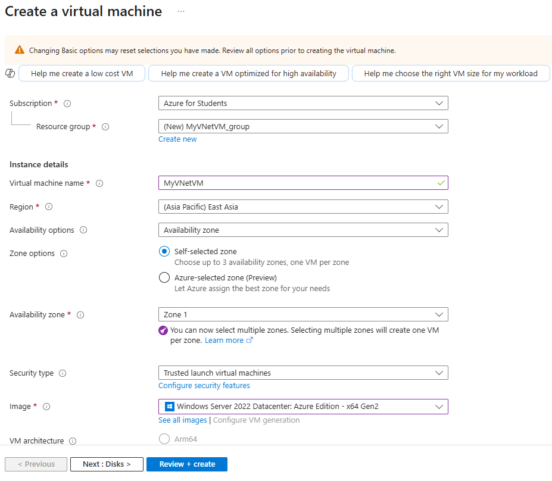
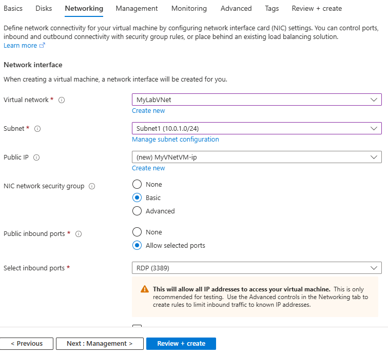
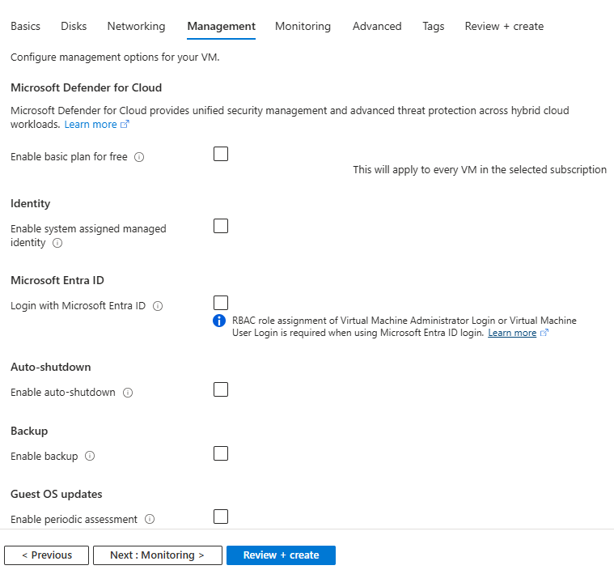
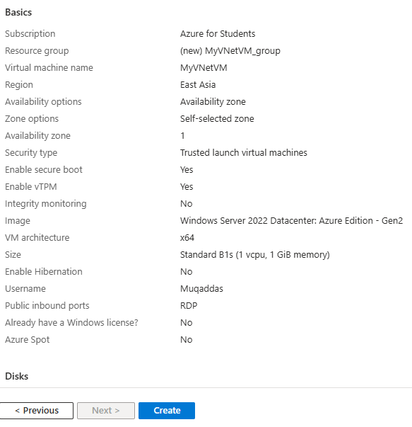
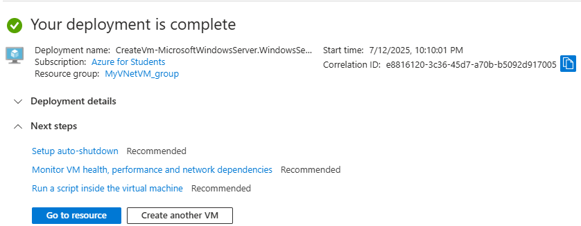
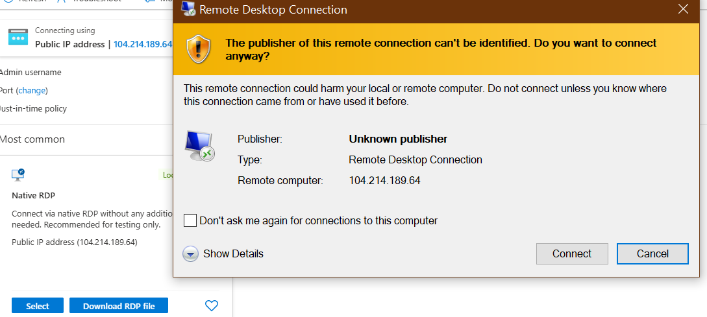
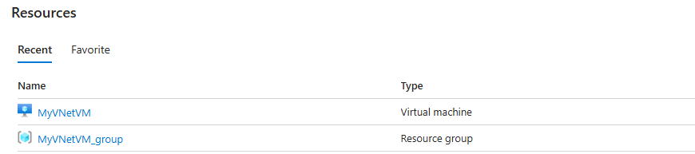

# 💻 Lab 4: Create Virtual Machine inside Azure Virtual Network (VNet)

## 📘 Introduction

In this lab, I created a *Windows Server 2022 Virtual Machine* and connected it to my existing *Virtual Network (MyLabVNet)* and *Subnet (Subnet1)*.  
This setup helps isolate the VM inside a secure private network and supports RDP connectivity through a public IP.

---

## 🧪 Steps with Screenshots

### ✅ Step 1: Open Azure Portal & Search for Virtual Machines  

---

### ✅ Step 2: Click "Create" and Select "Azure Virtual Machine"  

---

### ✅ Step 3: Fill Basic Details  
- Subscription: Azure for Students  
- Resource Group: MyResourceGroup  
- VM Name: MyVNetVM  
- Image: Windows Server 2022  
- Size: B1s (Free Tier)  
- Username: Muqaddas  
- Password: ********

---

### ✅ Step 4: Configure Networking  
- Virtual Network: MyLabVNet  
- Subnet: Subnet1  
- Public IP: Enabled  
- NSG: Basic with RDP (Port 3389)

---

### ✅ Step 5: Leave Default Settings  
(Management, Security, Monitoring untouched)

---

### ✅ Step 6: Review and Create  
- After validation passed  
- Click "Create"

---

### ✅ Step 7: Deployment Completed  
- Azure confirms successful VM deployment

---

### ✅ Step 8: Connect via RDP  
- Open VM Overview → Click "Connect"  
- Download RDP file and login

---
### ✅ Step 9: View in Resource Group  
- Confirm the VM is listed in MyResourceGroup

---
✅ Status: Completed Successfully
