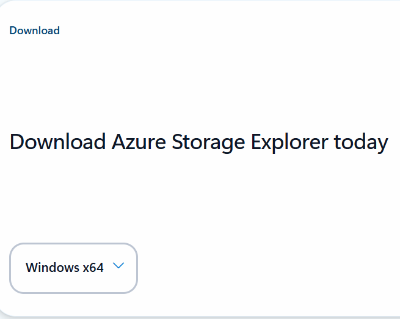
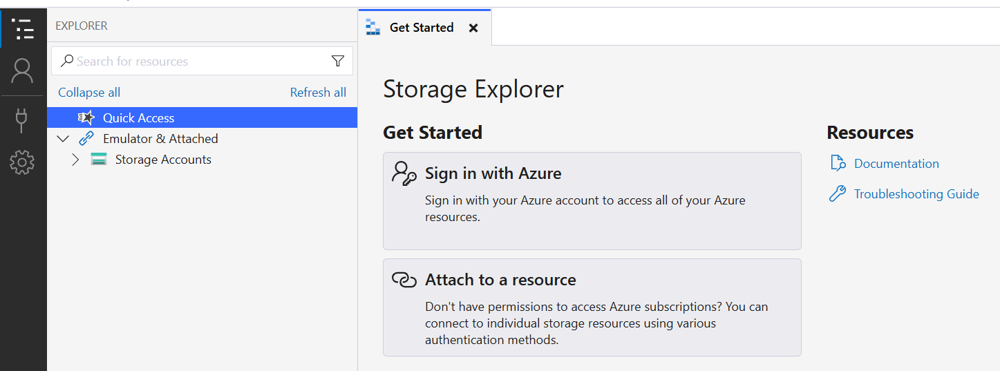
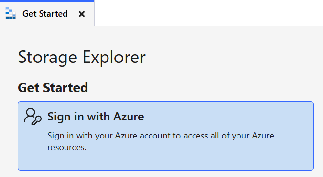
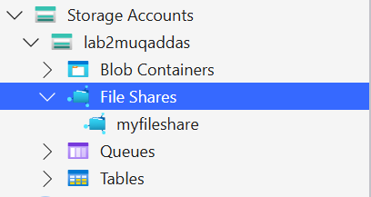
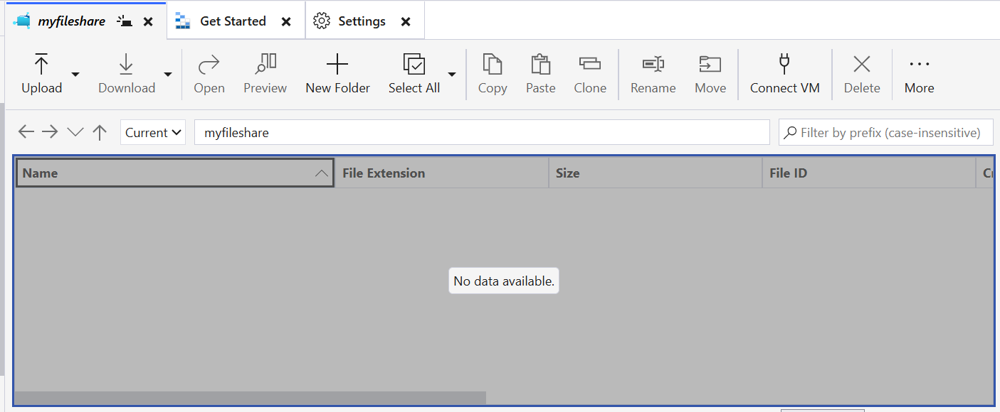
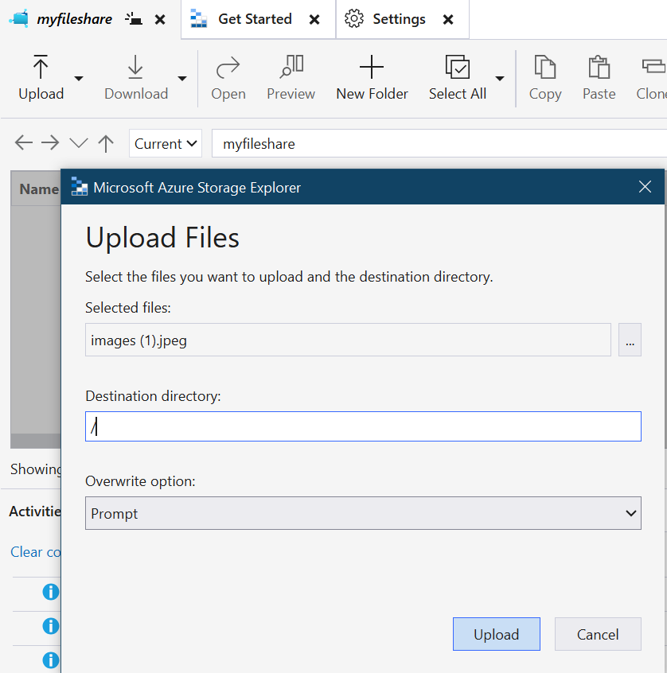
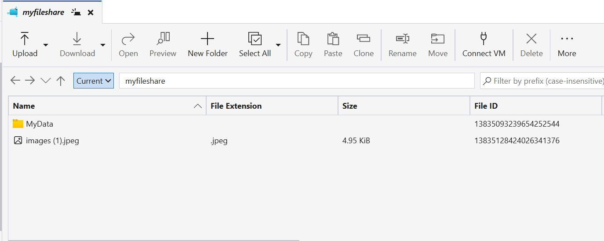
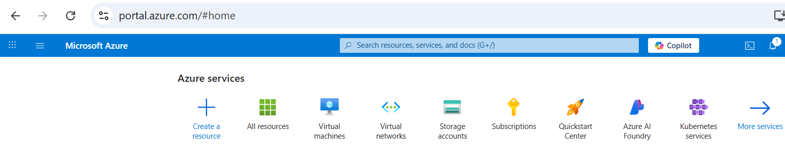
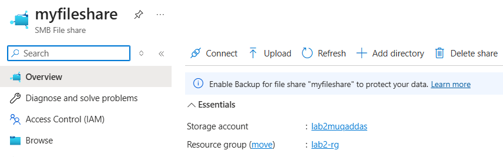
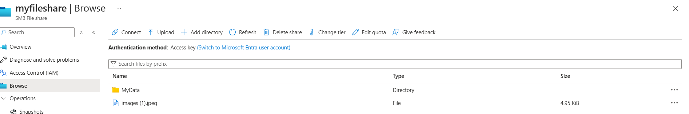

# 💻 Lab 5 – Access Azure File Share Using Azure Storage Explorer (Without VM)

---

## 🎯 Objective

Access Azure File Share from your *local system (Windows 10)* using *Azure Storage Explorer*, without using a Virtual Machine. Also verify uploaded file using the Azure Portal.

---

## 🧰 Tools Used
- Microsoft Azure Portal
- Azure Storage Explorer
- Local Windows 10 system

---

## 🪜 Steps with Screenshots

---

### 1️⃣ Download Azure Storage Explorer

Download link: [Azure Storage Explorer](https://azure.microsoft.com/en-us/products/storage/storage-explorer/)

---

### 2️⃣ Install & Launch the App

Install the downloaded file and open the application.

---

### 3️⃣ Sign in to Azure

Click on *Sign In*, and use your Microsoft Azure account credentials.

---

### 4️⃣ Expand Storage Account

In the left panel:  
*→ Your Subscription → Storage Accounts → [Storage Account Name]*

---

### 5️⃣ Open File Share

Navigate to:  
*Storage Account → File Shares → myfileshare*

---

### 6️⃣ Upload a File or Create Folder

Click on *Upload* to select a file from your system.  
You may also create folders if needed.

---

### 7️⃣ Verify File Appears

Check if your file or folder appears under the file share.

---

## 🔍 Confirm Upload on Azure Portal

---

### 8️⃣ Open Azure Portal

Go to [https://portal.azure.com](https://portal.azure.com)  
Login using the same Azure account.

---

### 9️⃣ Go to Storage Account

Search and open the storage account you used.

---

### 🔟 Go to File Shares

From the storage account sidebar, select *File Shares*, then click on your file share (myfileshare).

---

### 1️⃣1️⃣ View Uploaded File

Check that the uploaded file appears inside the Azure portal file share as well.

---

## ✅ Lab Result

✔ Successfully accessed and uploaded a file to Azure File Share using *Azure Storage Explorer*  
✔ Verified uploaded content using *Azure Portal*

---

## 🧠 Learning Outcome

- Understood Azure File Share concept  
- Learned to use Azure Storage Explorer  
- Performed file upload without VM  
- Verified file from Azure Portal

---
