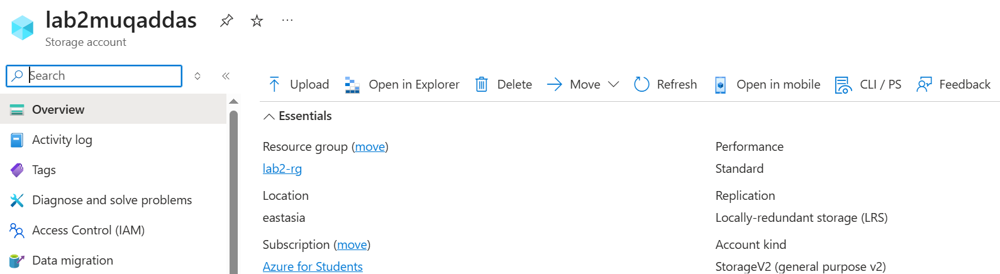
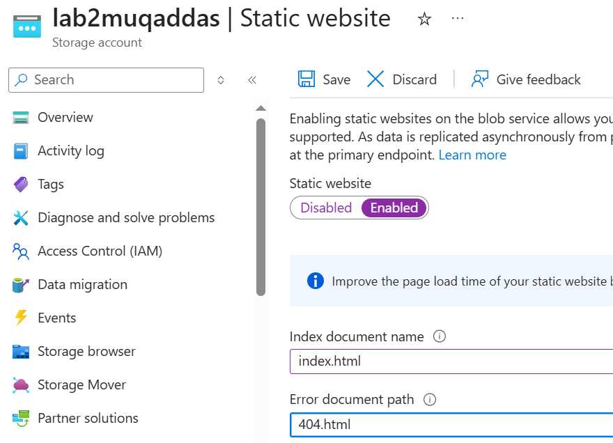
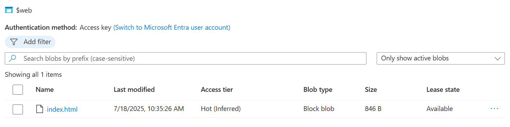
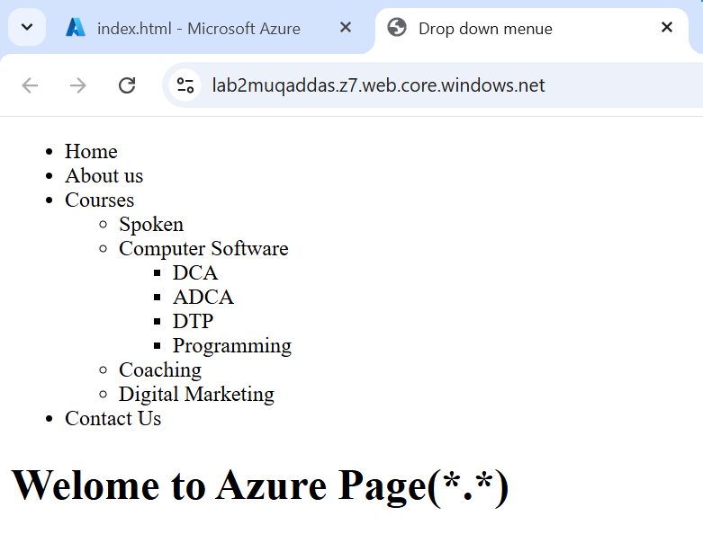

# 🌐 Lab: Host a Static Website Using Azure Storage

## 📚 Overview

In this lab,I learn how to host a static website using an Azure Storage Account. This is a beginner-friendly cloud computing task ideal for students using the *Azure for Students* subscription.

## 🎯 Objectives
- Create a Storage Account
- Enable Static Website Hosting
- Upload website files
- Access the site via public URL

---
## 🛠 Prerequisites

- Azure for Students account
- A simple HTML file (index.html) to upload

---

## 🔧 Steps

### 📌 Step 1: Create Storage Account  

### 📌 Step 2: Enable Static Website  

### 📌 Step 3: Upload Files to $web Container  

### 📌 Step 4: Open Public URL  

---

## ✅ Lab Successfully Completed 🎉
