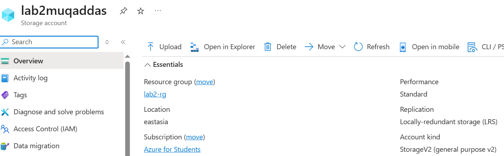
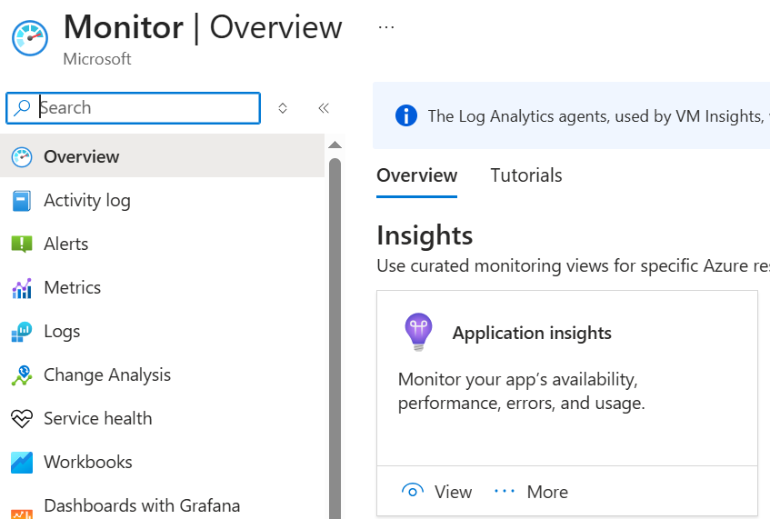
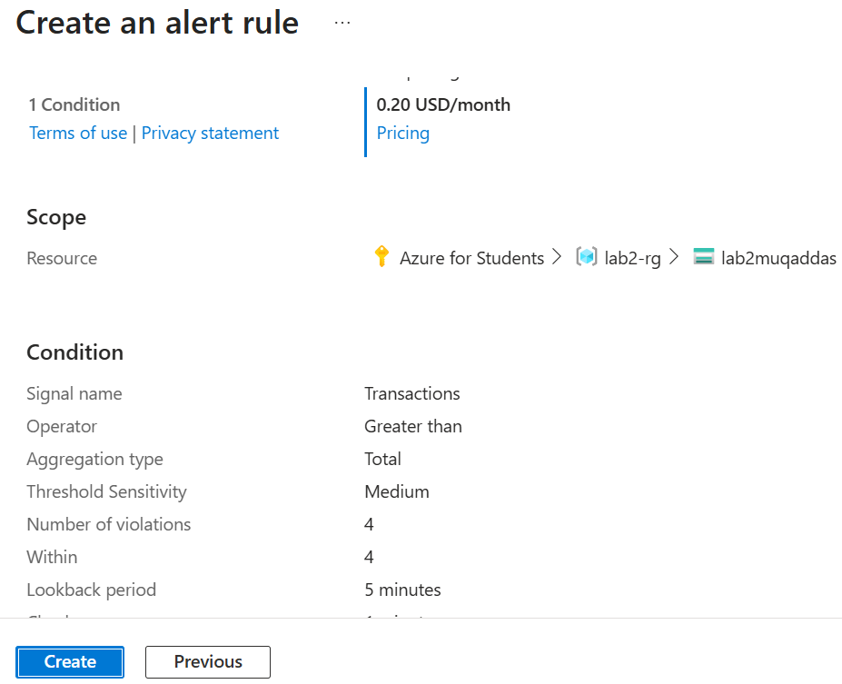
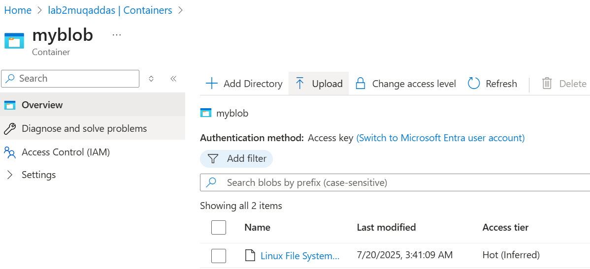
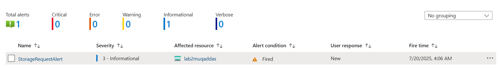

# 🔔 Lab 8: Azure Monitor Alert for Storage Account

## 🧾 Overview
This lab shows how to create an *alert rule in Azure Monitor* for a *Storage Account*.  
We use this to get notified when certain actions (like high requests or transactions) happen — useful for monitoring, performance, and security.

---

## 🎯 Objectives
- Create a Storage Account
- Create an Alert Rule using Azure Monitor
- Trigger the alert by generating activity
- Confirm the alert fired

---

## 🔧 Steps

### 📌 Step 1: Create a Storage Account  

---

### 📌 Step 2: Go to Azure Monitor → Alerts  

---

### 📌 Step 3: Create Alert Rule  
- Scope: Select Storage Account  
- Condition:  
  - Signal = Transactions  
  - Operator = Greater than  
  - Value = 1  
  - Aggregation = Total  
  - Threshold = Static  
- Evaluation:  
  - Check every 1 min  
  - Lookback 5 min  

---

### 📌 Step 4: Upload Files or Create Containers (Trigger Activity)  

---

### 📌 Step 5: Wait & Check Alert Status  

---

## ✅ Lab Successfully Completed 🎉
