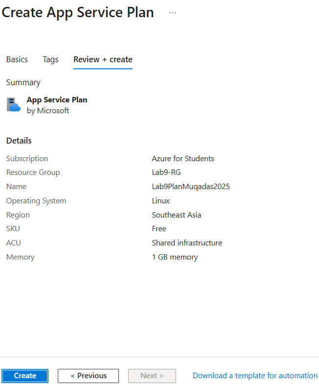
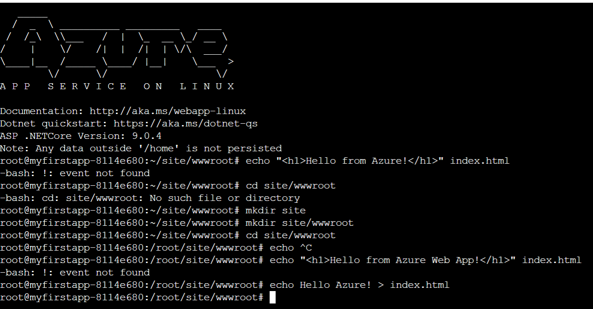

✅ Lab 9: Azure App Service Plan & Custom HTML Hosting

## 🧾 Overview
In this lab, I created and configured an Azure App Service Plan and hosted a custom static website using a simple index.html file.
This helps you understand how web apps are deployed on the cloud and how Azure serves static content using Linux-based App Services.
---

## 🎯 Objectives
- Create an App Service Plan
- Create a Web App
-Add a custom index.html page
- Access the app via browser

---

## 🔧 Steps

### 📌 Step 1: Create App Service Plan  

---

### 📌 Step 2: Create Web App  
- 

---

### 📌 Step 4: Use App Service Editor to Add Web Page  
- In site/wwwroot, create a file: index.html

📌 Step 5: Refresh Browser to See Your Page
Go back to Web App Overview → Click Browse

✅ Lab Successfully Completed 🎉
