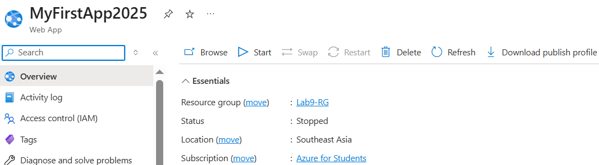
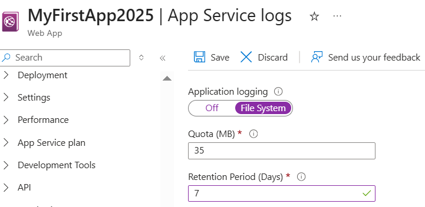
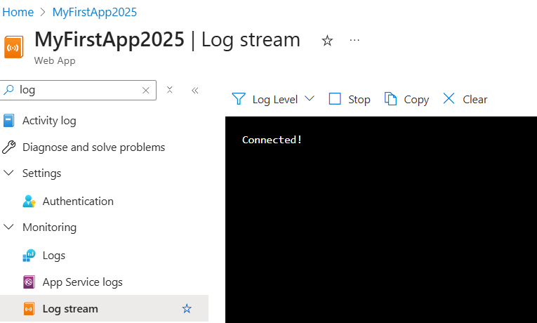
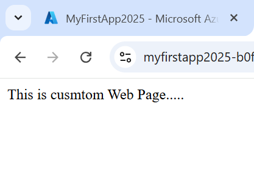

# ✅ Lab 10 – Enable and View Azure App Service Logs

## 🔍 Overview

In this lab, I enabled diagnostic logs for an Azure App Service and viewed live traffic/events using *Log Stream*. This helps developers monitor app health and troubleshoot real-time.

---

## 🎯 Objectives

- Enable diagnostic logging (Application + Web Server)
- View logs using *Log Stream*
- Understand how logging helps in debugging and monitoring

---

## 🧰 Prerequisites

- A working Azure Web App (from Lab 9)
- A deployed HTML file like index.html

---

## 🪜 Step-by-Step Instructions

### 🔸 Step 1: Open Your Web App   
Navigate to:  
Azure Portal > App Services > [web app]

 

---

### 🔸 Step 2: Enable App Service Logs  
Go to Monitoring > App Service logs and turn ON:
Click *Save*

---

### 🔸 Step 3: View Log Stream   
Go to Monitoring > Log stream  
Wait for the terminal to connect

 
---

### 🔸 Step 4: Generate Logs    
Open your web app URL:

---

### 🔸 ✅ Step 5: Success!
Logging is now enabled and working. You’re able to view live logs for monitoring, debugging, and performance tracking.

 

## ✅ Success!
App service is now logging to the file system. We can view real-time logs under *Log Stream*, helping us monitor and troubleshoot our deployed web app.

---
