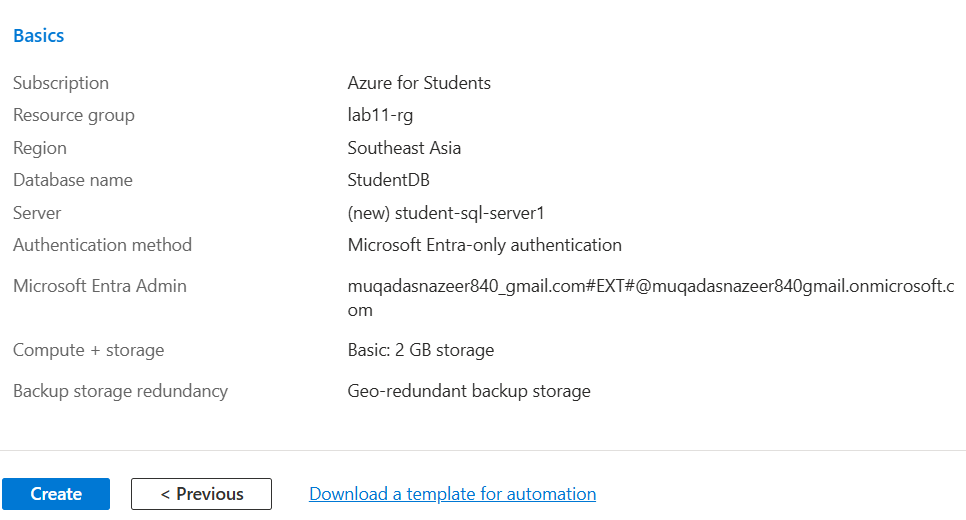
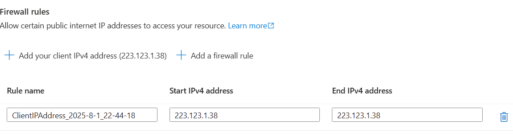
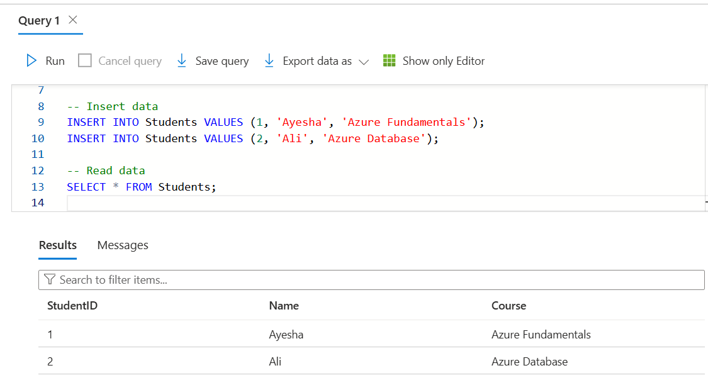

# 💻 Lab11: Working with Azure SQL Database (Microsoft Azure)

## 📘 Overview

This lab demonstrates how to create and interact with an Azure SQL Database using the Azure Portal. It includes step-by-step guidance and screenshots for better understanding.

---

## 🧠 Learning Objectives

- Deploy an Azure SQL Database
- Configure firewall and networking settings
- Run SQL queries using Azure Query Editor
- Understand cloud database basics (PaaS model)

---

## 🛠️ Tools Used

- Microsoft Azure Portal: https://portal.azure.com  
- Azure SQL Database (PaaS)
- Query Editor (Preview)

---

## 🧪 Lab Steps (with Screenshots)

### 🔹 Step 1: Create an Azure SQL Database

- Go to Azure Portal → "Create a resource" → Databases → SQL Database
- Fill in:
  - Database Name: `StudentDB`
  - Server: `student-sql-server` (Create new)
  - Admin Login: `azureuser`, Password: `YourStrongPassword!123`
  - Choose **Basic** pricing tier or Free

**🖼️ Screenshot:**

---

### 🔹 Step 2: Configure Firewall Settings

- Go to the **SQL server** (not the DB)
- Click **Networking**
- Click **"Add client IP"**
- Click **Save**

**🖼️ Screenshot:**

---

### 🔹 Step 3: Open Query Editor and Run SQL Commands

- Go to your `StudentDB` → **Query Editor (Preview)**
- Sign in with your SQL admin login

### 🏁 **Conclusion**
successfully:
Deployed and configured an Azure SQL Database
Executed SQL operations in the Azure Portal
Cleaned up cloud resources to avoid billing
This hands-on lab enhances understanding of Microsoft's PaaS offerings for databases.

