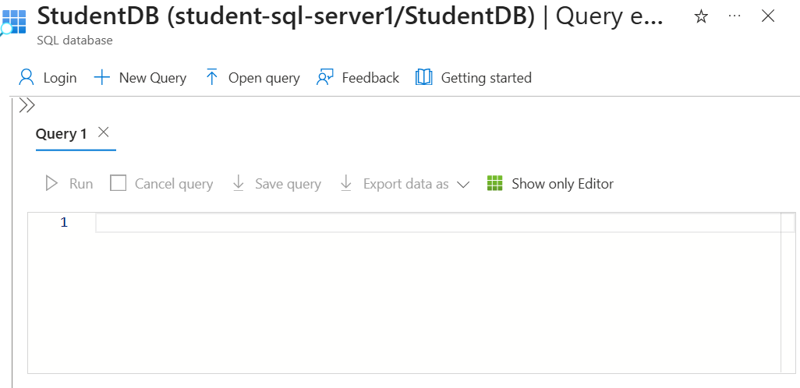
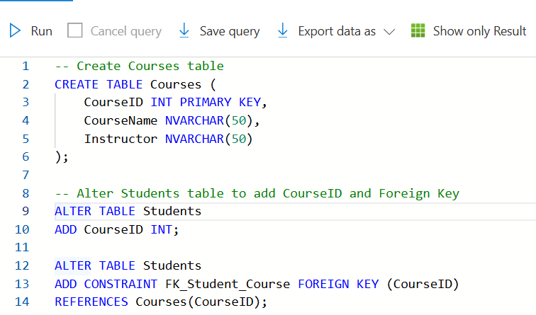
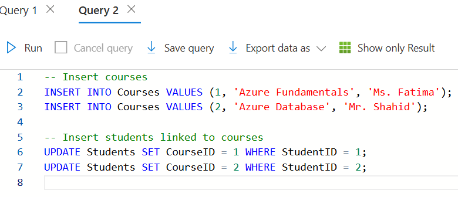
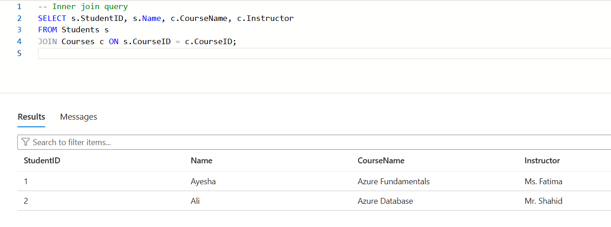
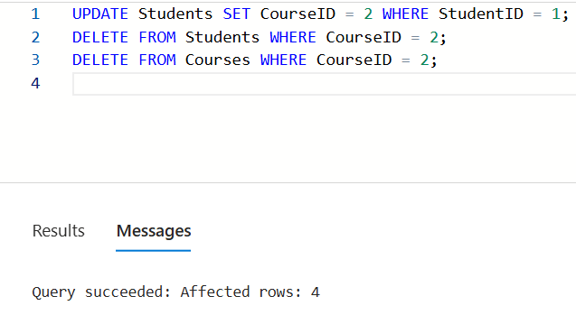
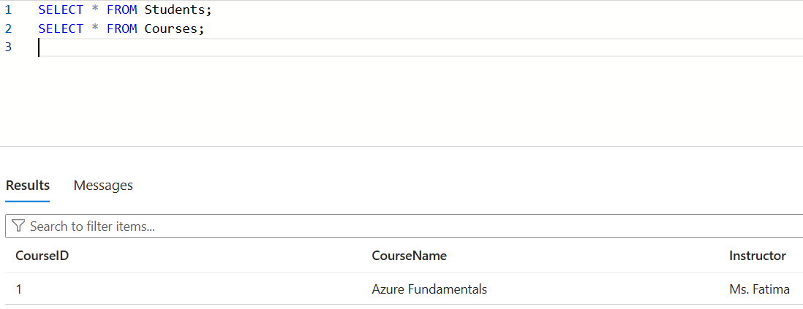

# 💻 Lab12: Advanced SQL in Azure Portal – Foreign Keys, JOINs, and Data Manipulation

## 📘 Overview

This lab builds on Lab11 and demonstrates advanced SQL operations directly in the Azure Portal using Query Editor (Preview).Enhance cloud database by creating table relationships, performing JOINs, and modifying data with `UPDATE` and `DELETE`. All tasks are done without external tools like SSMS or Azure Data Studio.

---

## 🧠 Learning Objectives

- Create relational table structures with foreign keys
- Execute JOIN queries to combine data from multiple tables
- Perform data updates and deletions with integrity constraints
- Strengthen understanding of SQL in a cloud-based environment

---

## 🛠️ Tools Used

- Azure Portal (Query Editor – Preview)
- Azure SQL Database (`StudentDB`)

---

## 🧪 Lab Steps

### 🔹 Step 1: Access Query Editor
- Log in to the [Azure Portal](https://portal.azure.com)
- Navigate to `StudentDB` → **Query Editor (Preview)**
- Authenticate with your SQL admin credentials

---

### 🔹 Step 2: Create Related Tables
- Create a `Courses` table with a primary key
- Add a `CourseID` column to the existing `Students` table
- Establish a foreign key relationship between the two tables

---

### 🔹 Step 3: Insert Sample Data
- Insert course records (e.g., Azure Fundamentals, Azure Database)
- Link students to their respective courses by updating `CourseID`

---

### 🔹 Step 4: Perform JOIN Query
- Use an inner join to retrieve student names along with their course and instructor

---

### 🔹 Step 5: Update & Delete Records
- Update student-course relationships
- Attempt to delete a course that is in use (demonstrates referential integrity)

---

### 🔹 Step 6: View Final Data
- Check the final state of the `Students` and `Courses` tables to confirm updates

---
## 🏁 Conclusion

This lab demonstrates how to perform real-world SQL operations like relationships, joins, and updates directly within Azure SQL using only the browser.Understand how to design and maintain relational databases on the cloud with enforced data integrity.

---

