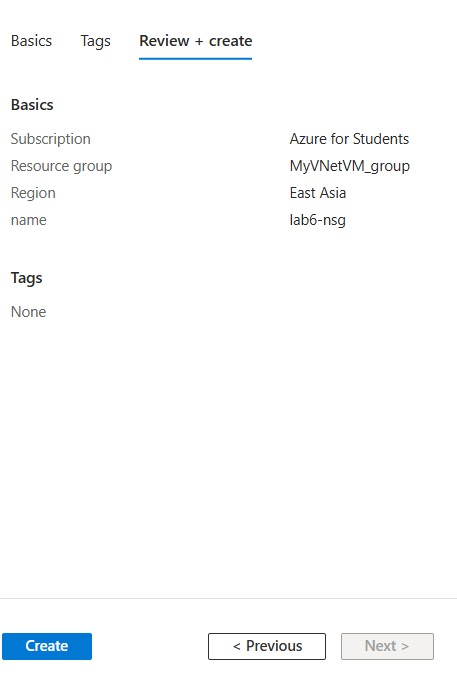
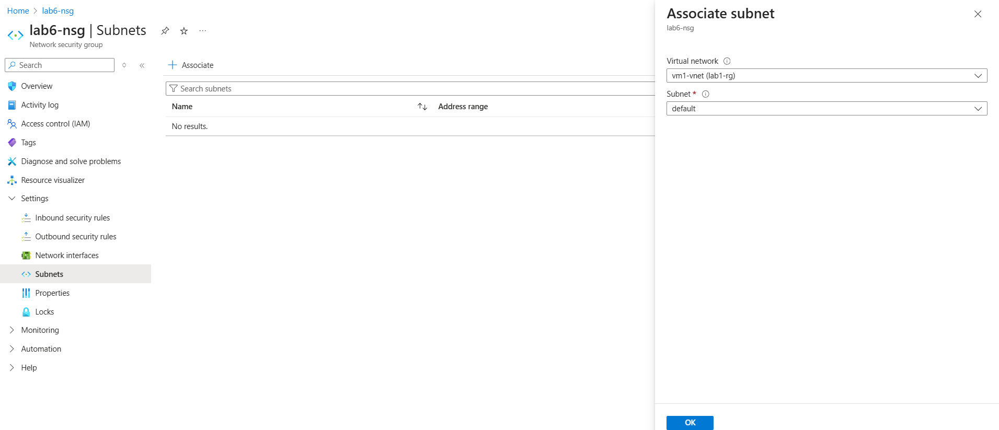
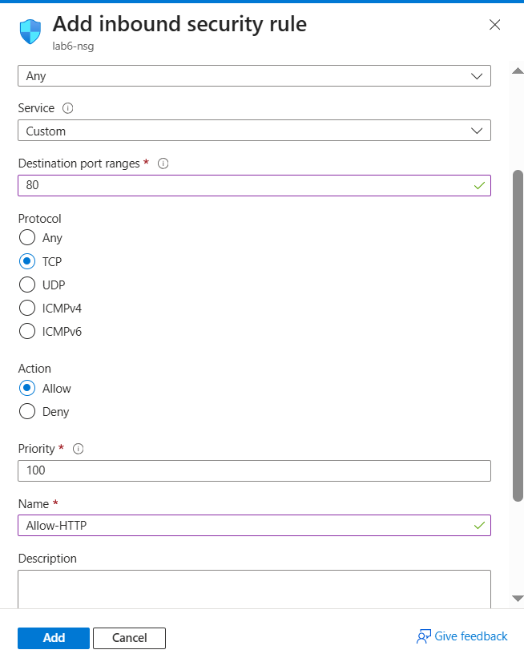
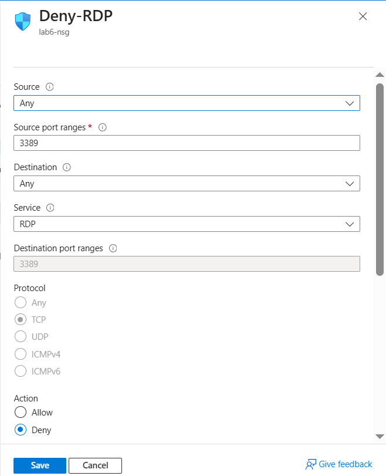
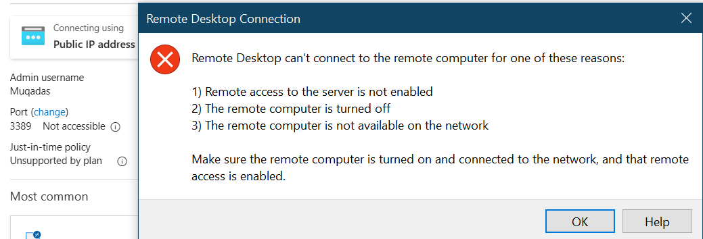

# 🔐 Lab 6 – Azure Network Security Group (NSG)

---

## 🎯 Objective

- Create a Network Security Group (NSG)
- Attach NSG to a *Subnet* or a *Network Interface (NIC)*
- Configure *custom inbound security rules*
- Test behavior using a *Virtual Machine*
- Allow HTTP (port 80), deny RDP (port 3389)

---

## 🧰 Prerequisites

- A deployed *Virtual Network (VNet)*
- A running *Virtual Machine*
- Basic understanding of ports (e.g., 80 = HTTP, 3389 = RDP)

---

## 🪜 Steps with Screenshots

---

### 1️⃣ Create NSG

- Open [https://portal.azure.com](https://portal.azure.com)
- Search “Network Security Groups” → Click *+ Create*
- Fill in:
  - Subscription
  - Resource Group
  - Name: lab6-nsg
  - Region: Same as VNet
- Click *Review + Create* → then *Create*
 

---

### 2️⃣ Attach NSG to Subnet

- Open the newly created NSG
- Go to *Settings* → *Subnets*
- Click *Associate*
- Choose:
  - Virtual Network
  - Subnet (e.g., default)

> ✅ Alternatively: You can attach NSG to NIC via VM > Networking > Network Interface

---

### 3️⃣ Add Inbound Rule for HTTP

- In NSG → Go to *Inbound security rules*
- Click *+ Add*
- Fill:
  - Source: Any
  - Destination: Any
  - Port: *80*
  - Protocol: TCP
  - Action: Allow
  - Priority: 100
  - Name: Allow-HTTP

---

### 4️⃣ Add Deny Rule for RDP (3389)

- Add another rule to block RDP:
  - Port: *3389*
  - Protocol: TCP
  - Action: Deny
  - Priority: 200
  - Name: Deny-RDP

---

### 5️⃣ Test the Rules

- Try RDP → Should be *blocked*
- Temporarily *delete* the deny rule if needed to connect via RDP
- Inside VM, enable HTTP (using IIS or Python server)
- Test http://localhost inside VM

---

## ✅ Result

- NSG successfully created and attached.
- Port 80 (HTTP) is allowed.
- Port 3389 (RDP) is denied.
- Rules tested via Virtual Machine.

---
